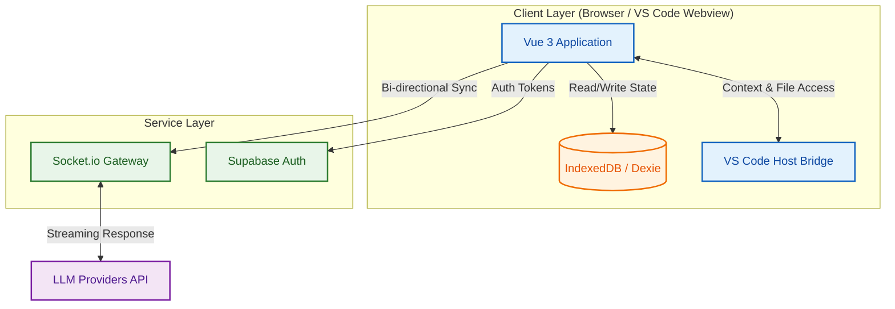
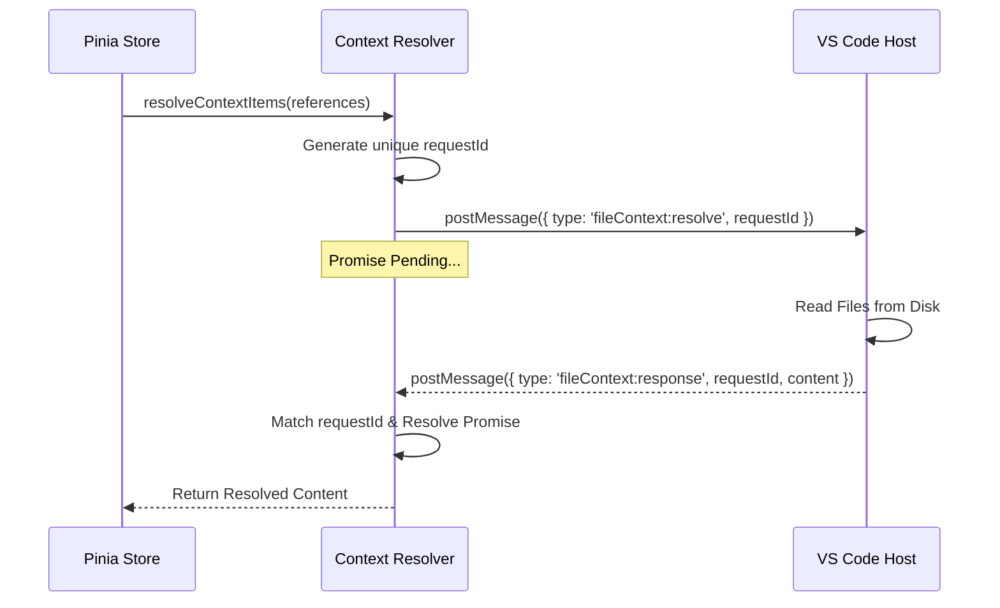
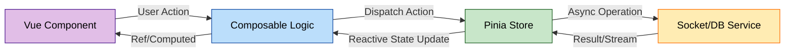
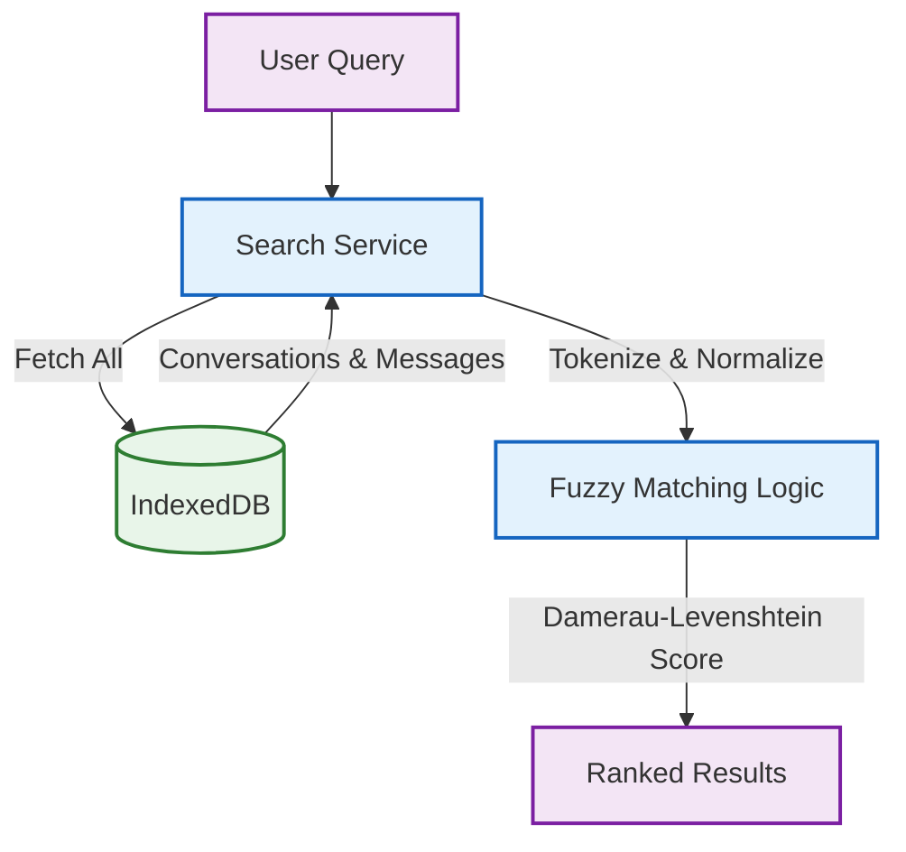

```mermaid
sequenceDiagram
    autonumber
    participant User
    participant Webview as Vue Webview
    participant Bridge as VS Code Bridge
    participant Supabase as Supabase Auth
    participant Socket as Socket Server

    rect rgb(30, 30, 40)
        note right of User: Scenario 1: Embedded in VS Code
        User->>Webview: Opens Extension
        Webview->>Bridge: Request Session (postMessage)
        Bridge-->>Webview: Return Github Session
        Webview->>Supabase: Set Session (Refresh Token)
        Supabase-->>Webview: Valid Session & Access Token
    end

    rect rgb(30, 35, 40)
        note right of User: Scenario 2: Standalone Browser
        User->>Webview: Clicks Login
        Webview->>Supabase: OAuth Flow (PKCE)
        Supabase-->>Webview: Session & Access Token
    end

    Webview->>Socket: Connect (auth: Access Token)
    Socket-->>Webview: Connection Established
```

# BabaDeluxe AI Webview

> **Empowering Engineering Excellence through Superior AI Integration.**

## Overview

Welcome to the **BabaDeluxe Webview** repository. This project serves as the sophisticated frontend interface for our next-generation AI coding assistant. Designed with enterprise scalability and developer ergonomics in mind, it leverages a modern Vue 3 ecosystem to deliver a seamless, high-performance conversational experience within IDEs.

Our mission is to augment developer productivity by providing context-aware, intelligent code assistance that integrates deeply with existing workflows.

## Table of Contents

- [Overview](#overview)
- [Architecture & Tech Stack](#architecture--tech-stack)
- [Key Architecture Concepts](#key-architecture-concepts)
- [Deep VS Code Integration](#deep-vs-code-integration)
- [Authentication Architecture](#authentication-architecture)
- [Project Structure](#project-structure)
- [Prerequisites](#prerequisites)
- [Getting Started](#getting-started)
- [Contribution Guidelines](#contribution-guidelines)

## Architecture & Tech Stack

We adhere to a strict, modern technology stack to ensure maintainability, type safety, and performance:

- **Core Framework:** Vue 3 (Composition API) with TypeScript.
- **State Management:** Pinia for modular and type-safe state handling.
- **Build System:** Vite for lightning-fast HMR and optimized production builds.
- **Styling:** UnoCSS for atomic, on-demand CSS generation combined with Tailwind conventions.
- **Database:** Dexie.js (IndexedDB wrapper) for robust client-side persistence of chat history and context.
- **Real-time Communication:** Socket.io-client for low-latency communication with the backend services.
- **Validation & Safety:** Zod for runtime schema validation and Neverthrow for functional error handling.
- **Testing:**



- **Unit:** Vitest
- **E2E:** Playwright

## Key Architecture Concepts

### Modular Composables

We utilize the Composition API to encapsulate logic into reusable, testable units. Key composables include:

- **UI Logic:** `use-button-variants`, `use-dropdown`, `use-teleported-menu-position` for complex UI state management.
- **Utilities:** `use-date-formatter`, `use-tracked-timeouts` for robust resource cleanup.
- **Communication:** `use-socket-listener` for type-safe event handling.

### Robust Client-Side Persistence

Our data layer is built on top of `Dexie.js` but enhanced with custom wrappers for enterprise-grade safety:

- **SafeCollection / SafeTable:** Provides strongly-typed wrappers around Dexie collections to prevent runtime errors and ensure schema consistency.
- **KeyValueDb:** A specialized store for managing key-value pairs with automatic timestamp tracking (`updatedAt`).
- **Context Awareness:** The database schema handles complex context references (files, snippets) necessary for AI model interactions.

### Error Handling & Resilience Strategy

We prioritize system stability through defensive programming patterns:

- **Explicit Result Types:** We utilize `neverthrow` to replace exception throwing with type-safe `Result` objects, forcing consumers to handle both success and failure cases explicitly.
- **Structured Error Hierarchy:** A comprehensive set of custom error classes (`DbError`, `NetworkError`, `RateLimitError`) enables granular error handling and precise UI feedback.
- **Automatic Retries:** Critical network operations (e.g., model listing, message sending) are protected by a `retryWithBackoff` utility that implements exponential backoff with jitter to handle transient failures gracefully.

### Deep VS Code Integration

This webview is not just an iframe; it is a deeply integrated part of the IDE experience:

- **Bi-directional Communication:** A strongly-typed message bridge facilitates seamless data exchange between the Vue frontend and the VS Code extension host.
- **Context Awareness:** The application manages complex context states, including pinned files and intelligent suggestions, resolving file contents directly from the editor's document model.
- **Shared Authentication:** Authentication sessions are synchronized between the extension and the webview to provide a frictionless "sign-in once" experience.

#### Context Resolution Flow

The application uses an asynchronous message bridge to resolve file contents from VS Code securely:



### Dependency Injection & State Management

- **Strict Dependency Injection:** We enforce a strict DI pattern using Vue's `provide`/`inject` mechanism combined with `Symbol`-based keys and a `safeInject` helper. This ensures runtime dependency availability and facilitates easy mocking for tests.
- **Store Architecture:** Pinia stores (`useConversationStore`, `useVsCodeContextStore`) act as the single source of truth for domain state, managing complex asynchronous flows and side effects securely.



### Performance & Search

- **Client-Side Fuzzy Search:** To ensure instant feedback, we implement a client-side search service using Damerau-Levenshtein distance algorithms, allowing users to find messages and conversations efficiently without server round-trips.
- **Optimized Rendering:** Markdown rendering is highly optimized, supporting syntax highlighting, Mermaid diagrams, and LaTeX math via `katex`, all while ensuring security through `DOMPurify` sanitization.



### Real-time Streaming & UX

- **Optimized Stream Handling:** The application implements a sophisticated streaming architecture that handles high-frequency socket events. We utilize a throttled commit strategy (`streamingCommitIntervalMs`) to update the DOM efficiently without blocking the main thread during rapid token generation.
- **Rich Content Rendering:** Our `ChatMarkdownRenderer` handles partial markdown streams gracefully, supporting complex artifacts like Mermaid diagrams, LaTeX equations (KaTeX), and syntax-highlighted code blocks in real-time.

### Strict Configuration & Security

- **Runtime Environment Validation:** We refuse to start the application with invalid configurations. The `env-validator.ts` module uses Zod to strictly validate all environment variables at boot time, preventing subtle configuration drift issues in production.
- **Secure API Key Management:** API keys are never stored in plain text without validation. The `ApiKeyValidator` service performs a live check against the provider's API before persisting keys to the secure `KeyValueStore`, ensuring the system remains in a valid state.

### Enterprise Design System & UX

Our UI is built on a sophisticated, accessible-first design system (`src/components/Base*`), ensuring consistency and compliance across the enterprise.

- **Dynamic Theming:** We utilize `colorino` to generate harmonious color palettes (e.g., Catppuccin Mocha) that ensure visual consistency.
- **Automated Accessibility:** Interactive elements like `BaseButton` calculate their text color at runtime using `culori` based on background luminosity, strictly satisfying WCAG contrast ratios.
- **Iconography:** A hybrid approach using `UnoCSS` preset icons (Bootstrap Icons, Simple Icons) for standard UI elements and custom SVG assets (e.g., Cyberpunk Robot) for brand identity.
- **Keyboard Navigation:** The application is fully navigable via keyboard, with managed focus states and specific key bindings (e.g., `Esc` to cancel edits, `Ctrl+Enter` to submit) handled by composables like `use-tracked-timeouts`.

### Authentication Architecture

The application implements a dual-strategy authentication system to ensure seamless operation across environments:

- **VS Code Tunneling:** When embedded in VS Code, auth tokens are securely bridged from the extension host to the webview. The `useVsCodeAuth` composable manages session synchronization, eliminating the need for repeated logins within the IDE.
- **Standard OAuth/Email:** For standalone development, we utilize Supabase Auth with PKCE flows (GitHub/Email), fully decoupled from the VS Code context.



### Project Structure

The codebase is organized to promote separation of concerns and discoverability:

| Directory         | Purpose                                                                      |
| :---------------- | :--------------------------------------------------------------------------- |
| `src/composables` | Reusable stateful logic (hooks), strictly typed and tested.                  |
| `src/stores`      | Global domain state (Pinia) for Conversations, Context, and UI state.        |
| `src/database`    | IndexedDB layer with `Dexie.js` and custom type-safe wrappers (`SafeTable`). |
| `src/vs-code`     | Bridge logic, type guards, and message protocols for IDE communication.      |
| `src/components`  | Atomic design components (`Base*`) and complex feature widgets.              |
| `src/views`       | Route-level page components (Chat, History, Prompts, Settings).              |
| `src/validators`  | Zod schemas for runtime data validation.                                     |

### Environment Configuration

We enforce strict runtime validation of environment variables using `Zod`. The application will fail to boot if the configuration schema is not met.

Create a `.env` file in the root directory:

```properties
# App Environment (development | production | test)
VITE_NODE_ENV=development

# Supabase Configuration (Auth & Database)
VITE_SUPABASE_URL=https://your-project.supabase.co
VITE_SUPABASE_ANON_KEY=your-anon-key

# Real-time Service
VITE_SOCKET_URL=http://localhost:3000
```

## Prerequisites

Ensure your development environment meets the following criteria:

- **Node.js:** v20.19.0+ or v22.12.0+ (strictly enforced via engines)
- **Package Manager:** NPM v9+

## Getting Started

### 1. Installation

Clone the repository and install dependencies:

```bash
npm install
```

### 2. Development

Start the development server with HMR enabled:

```bash
npm run dev
```

For performance profiling during development:

```bash
npm run dev-performance
```

### 3. Quality Assurance

We maintain rigorous code quality standards. Run the full test suite before pushing:

```bash
npm test
```

- **Unit Tests:** `npm run test-unit`
- **E2E Tests:** `npm run test-e2e`
- **Type Checking:** `npm run type-check`
- **Linting & Formatting:** `npm run format`

## Scripts

| Script           | Description                                                    |
| :--------------- | :------------------------------------------------------------- |
| `dev`            | Starts the Vite development server.                            |
| `build`          | Runs type checks and produces a production-ready build.        |
| `test`           | Executes both unit and end-to-end test suites.                 |
| `format`         | Fixes linting issues and formats code with Prettier.           |
| `find-dead-code` | Analyzes the codebase for unused exports and types using Knip. |

## Contribution Guidelines

We welcome contributions! Please see our [CONTRIBUTING.md](CONTRIBUTING.md) for comprehensive details on our development workflow, coding standards, and submission process.

1. **Code Style:** Strict adherence to TypeScript strict mode and Vue 3 Composition API patterns is required.
2. **Commit Convention:** Use semantic commit messages.
3. **Testing:** All new features must be accompanied by comprehensive unit tests. UI changes require E2E coverage.

## License

This project is licensed under the **European Union Public License 1.2 (EUPL-1.2)**.

---

**BabaDeluxe** — _Redefining the Future of Software Development._
