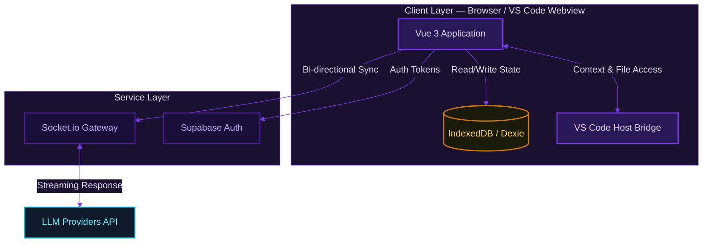
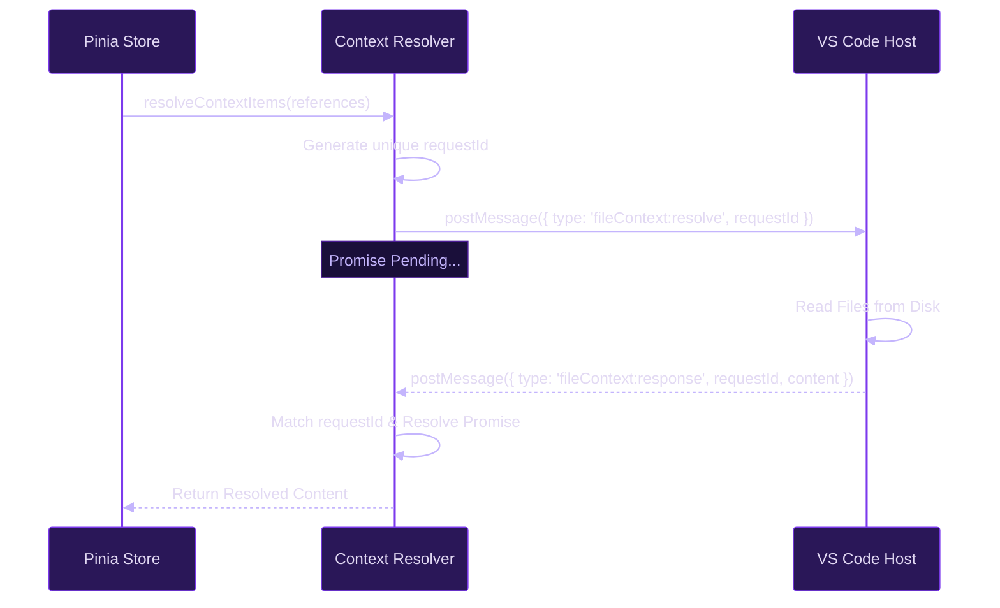
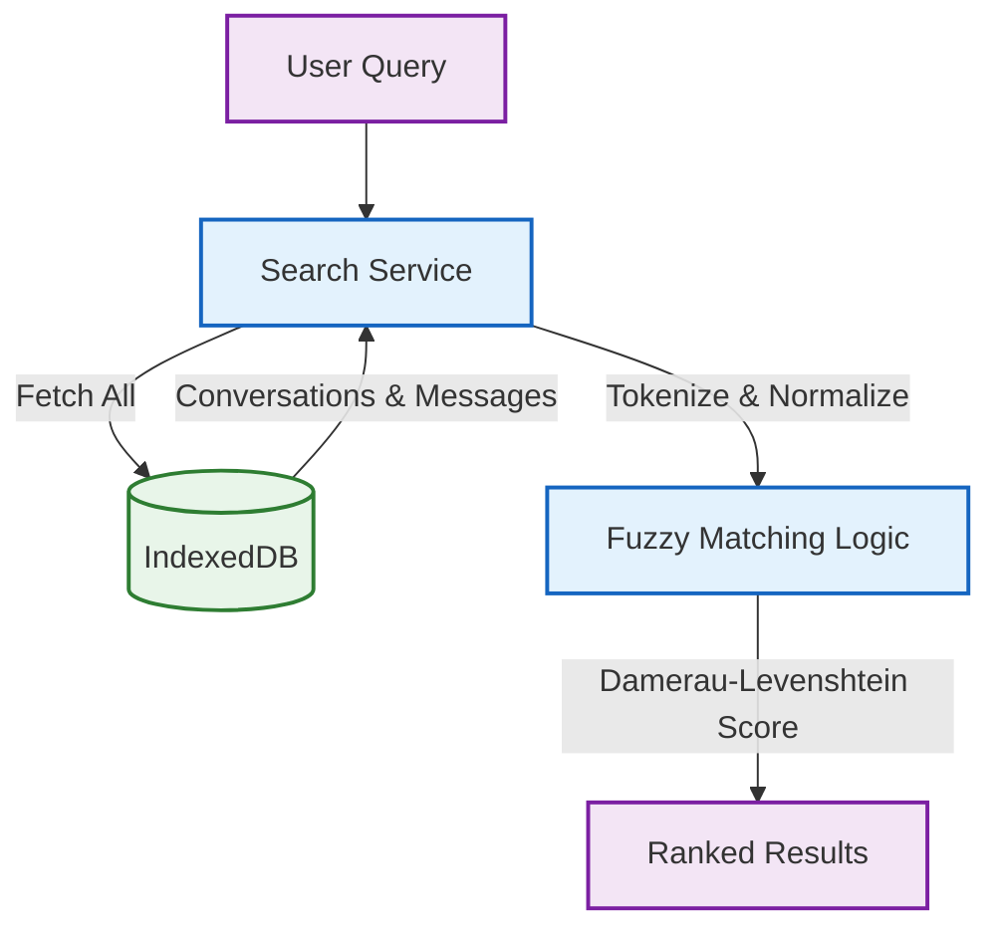
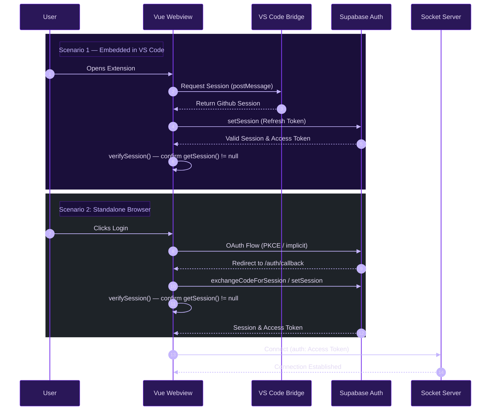
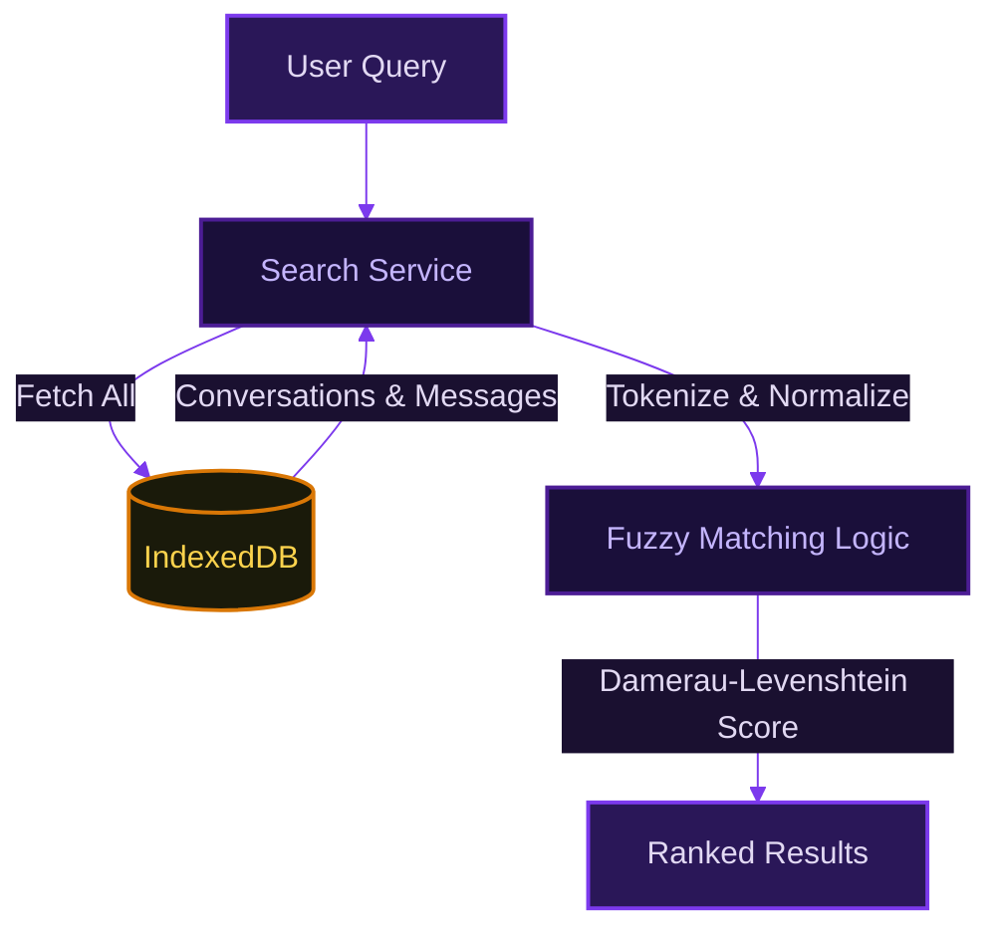

# babadeluxe-webview

<p align="left">
  
  
  
  
</p>

> **The chat UI for BabaDeluxe AI Coder.** A Vue 3 webview embedded in the VS Code extension, with full support for real-time streaming, Mermaid diagrams, KaTeX math, and persistent local chat history.

## Overview

This repo contains the frontend that runs inside the VS Code webview panel. It communicates bidirectionally with the extension host via a typed message bridge, connects to the backend over Socket.io, and stores all chat history locally in IndexedDB via Dexie.

## Architecture & Tech Stack

- **Core:** Vue 3 (Composition API) + TypeScript
- **State:** Pinia
- **Build:** Vite
- **Styling:** UnoCSS (Tailwind conventions)
- **Persistence:** Dexie.js (IndexedDB)
- **Real-time:** Socket.io-client
- **Validation:** Zod + neverthrow
- **Testing:** Vitest (unit) + Playwright (E2E)


```mermaid
%%{init: {'theme': 'base', 'themeVariables': {'background': '#13111a', 'primaryColor': '#2a1758', 'primaryTextColor': '#e2d9f3', 'primaryBorderColor': '#7c3aed', 'lineColor': '#7c3aed', 'secondaryColor': '#1a0f3a', 'tertiaryColor': '#0f1a2a', 'edgeLabelBackground': '#1a1030', 'clusterBkg': '#1a1030', 'clusterBorder': '#4c1d95', 'titleColor': '#e2d9f3', 'nodeBorder': '#7c3aed', 'mainBkg': '#2a1758', 'fontFamily': 'monospace'}}}%%
graph TD
    classDef client fill:#2a1758,stroke:#7c3aed,stroke-width:2px,color:#e2d9f3
    classDef backend fill:#1a0f3a,stroke:#4c1d95,stroke-width:2px,color:#c4b5fd
    classDef storage fill:#1a1a0a,stroke:#d97706,stroke-width:2px,color:#fcd34d
    classDef ext fill:#0f1a2a,stroke:#0891b2,stroke-width:2px,color:#67e8f9

    subgraph ClientLayer ["Client Layer — Browser / VS Code Webview"]
        direction TB
        VueApp[Vue 3 Application]:::client
        DexieDB[(IndexedDB / Dexie)]:::storage
        VSCodeBridge[VS Code Host Bridge]:::client
    end

    subgraph ServiceLayer ["Service Layer"]
        SocketServer[Socket.io Gateway]:::backend
        Supabase[Supabase Auth]:::backend
    end

    External[LLM Providers API]:::ext

    VueApp -->|Read/Write State| DexieDB
    VueApp -->|Bi-directional Sync| SocketServer
    VueApp -->|Auth Tokens| Supabase
    VueApp <-->|Context & File Access| VSCodeBridge

    SocketServer <-->|Streaming Response| External
```

## Key Architecture Concepts

### VS Code Message Bridge

A typed message bridge handles all communication between the Vue app and the extension host. File contents are resolved asynchronously via request/response pairs keyed by a unique `requestId`:


```mermaid
%%{init: {'theme': 'base', 'themeVariables': {'background': '#13111a', 'primaryColor': '#2a1758', 'primaryTextColor': '#e2d9f3', 'primaryBorderColor': '#7c3aed', 'lineColor': '#7c3aed', 'secondaryColor': '#1a0f3a', 'tertiaryColor': '#0f1a2a', 'edgeLabelBackground': '#1a1030', 'actorBkg': '#2a1758', 'actorBorder': '#7c3aed', 'actorTextColor': '#e2d9f3', 'actorLineColor': '#7c3aed', 'signalColor': '#c4b5fd', 'signalTextColor': '#e2d9f3', 'labelBoxBkgColor': '#1a0f3a', 'labelBoxBorderColor': '#4c1d95', 'labelTextColor': '#c4b5fd', 'loopTextColor': '#e2d9f3', 'noteBkgColor': '#1a0f3a', 'noteTextColor': '#c4b5fd', 'noteBorderColor': '#4c1d95', 'activationBkgColor': '#4c1d95', 'activationBorderColor': '#7c3aed', 'sequenceNumberColor': '#e2d9f3', 'fontFamily': 'monospace'}}}%%
sequenceDiagram
    participant Store as Pinia Store
    participant Resolver as Context Resolver
    participant Host as VS Code Host

    Store->>Resolver: resolveContextItems(references)
    Resolver->>Resolver: Generate unique requestId
    Resolver->>Host: postMessage({ type: 'fileContext:resolve', requestId })

    Note over Resolver: Promise Pending...

    Host->>Host: Read Files from Disk
    Host-->>Resolver: postMessage({ type: 'fileContext:response', requestId, content })

    Resolver->>Resolver: Match requestId & Resolve Promise
    Resolver-->>Store: Return Resolved Content
```

### State & Data Layer

Pinia stores are the single source of truth for all domain state. The Dexie layer adds custom `SafeCollection`/`SafeTable` wrappers for type-safe IndexedDB access and a `KeyValueDb` store with automatic `updatedAt` tracking.


```mermaid
%%{init: {'theme': 'base', 'themeVariables': {'background': '#13111a', 'primaryColor': '#2a1758', 'primaryTextColor': '#e2d9f3', 'primaryBorderColor': '#7c3aed', 'lineColor': '#7c3aed', 'edgeLabelBackground': '#1a1030', 'clusterBkg': '#1a1030', 'clusterBorder': '#4c1d95', 'titleColor': '#e2d9f3', 'fontFamily': 'monospace'}}}%%
flowchart LR
    classDef view fill:#2a1758,stroke:#7c3aed,stroke-width:2px,color:#e2d9f3
    classDef logic fill:#1a0f3a,stroke:#4c1d95,stroke-width:2px,color:#c4b5fd
    classDef state fill:#0f2a1a,stroke:#059669,stroke-width:2px,color:#6ee7b7
    classDef infra fill:#1a1a0a,stroke:#d97706,stroke-width:2px,color:#fcd34d

    View[Vue Component]:::view
    Composable[Composable Logic]:::logic
    Store[Pinia Store]:::state
    Service[Socket / DB Service]:::infra

    View -->|User Action| Composable
    Composable -->|Dispatch Action| Store
    Store -->|Async Operation| Service
    Service -->|Result / Stream| Store
    Store -->|Reactive State Update| Composable
    Composable -->|Ref / Computed| View
```

### Error Handling

- **Client-Side Fuzzy Search:** To ensure instant feedback, we implement a client-side search service using Damerau-Levenshtein distance algorithms, allowing users to find messages and conversations efficiently without server round-trips.
- **Optimized Rendering:** Markdown rendering is highly optimized, supporting syntax highlighting, Mermaid diagrams, and LaTeX math via `katex`, all while ensuring security through `DOMPurify` sanitization.


```mermaid
graph TD
    classDef input fill:#f3e5f5,stroke:#7b1fa2,stroke-width:2px
    classDef process fill:#e3f2fd,stroke:#1565c0,stroke-width:2px
    classDef store fill:#e8f5e9,stroke:#2e7d32,stroke-width:2px

    UserInput[User Query]:::input --> SearchService
    SearchService[Search Service]:::process -->|Fetch All| DB[(IndexedDB)]:::store
    DB -->|Conversations & Messages| SearchService
    SearchService -->|Tokenize & Normalize| FuzzyLogic[Fuzzy Matching Logic]:::process
    FuzzyLogic -->|Damerau-Levenshtein Score| Results[Ranked Results]:::input
```

### Real-time Streaming & UX

- **Optimized Stream Handling:** The application implements a sophisticated streaming architecture that handles high-frequency socket events. We utilize a throttled commit strategy (`streamingCommitIntervalMs`) to update the DOM efficiently without blocking the main thread during rapid token generation.
- **Rich Content Rendering:** Our `ChatMarkdownRenderer` handles partial markdown streams gracefully, supporting complex artifacts like Mermaid diagrams, LaTeX equations (KaTeX), and syntax-highlighted code blocks in real-time.

### Strict Configuration & Security

- **Runtime Environment Validation:** We refuse to start the application with invalid configurations. The `env-validator.ts` module uses Zod to strictly validate all environment variables at boot time, preventing subtle configuration drift issues in production.
- **Secure API Key Management:** API keys are never stored in plain text without validation. The `ApiKeyValidator` service performs a live check against the provider's API before persisting keys to the secure `KeyValueStore`, ensuring the system remains in a valid state.

### Enterprise Design System & UX

Our UI is built on a sophisticated, accessible-first design system (`src/components/Base*`), ensuring consistency and compliance across the enterprise.

- **Dynamic Theming:** We utilize `colorino` to generate harmonious color palettes (e.g., Catppuccin Mocha) that ensure visual consistency.
- **Automated Accessibility:** Interactive elements like `BaseButton` calculate their text color at runtime using `culori` based on background luminosity, strictly satisfying WCAG contrast ratios.
- **Iconography:** A hybrid approach using `UnoCSS` preset icons (Bootstrap Icons, Simple Icons) for standard UI elements and custom SVG assets (e.g., Cyberpunk Robot) for brand identity.
- **Keyboard Navigation:** The application is fully navigable via keyboard, with managed focus states and specific key bindings (e.g., `Esc` to cancel edits, `Ctrl+Enter` to submit) handled by composables like `use-tracked-timeouts`.

### Authentication Architecture

The application implements a dual-strategy authentication system to ensure seamless operation across environments:

- **VS Code Token Bridge:** When embedded in VS Code, auth tokens are securely bridged from the extension host to the webview via `postMessage`. The `useVsCodeAuth` composable manages session synchronization, eliminating the need for repeated logins within the IDE.
- **Standard OAuth / Email:** For browser access, Supabase Auth handles GitHub OAuth (PKCE and implicit flows) and email/password — fully decoupled from the VS Code context.
- **Session Verification:** After every auth call (`setSession`, `exchangeCodeForSession`), the app explicitly calls `getSession()` to confirm the session is readable before navigating. This guards against a race condition where Supabase's internal state cache is not yet populated when `router.beforeEach` fires.

For full details on every flow, edge cases, and the session race condition fix, see **[docs/AUTH_FLOWS.md](docs/AUTH_FLOWS.md)**.


```mermaid
%%{init: {'theme': 'base', 'themeVariables': {'background': '#13111a', 'primaryColor': '#2a1758', 'primaryTextColor': '#e2d9f3', 'primaryBorderColor': '#7c3aed', 'lineColor': '#7c3aed', 'secondaryColor': '#1a0f3a', 'tertiaryColor': '#0f1a2a', 'edgeLabelBackground': '#1a1030', 'actorBkg': '#2a1758', 'actorBorder': '#7c3aed', 'actorTextColor': '#e2d9f3', 'actorLineColor': '#7c3aed', 'signalColor': '#c4b5fd', 'signalTextColor': '#e2d9f3', 'labelBoxBkgColor': '#1a0f3a', 'labelBoxBorderColor': '#4c1d95', 'labelTextColor': '#c4b5fd', 'loopTextColor': '#e2d9f3', 'noteBkgColor': '#1a0f3a', 'noteTextColor': '#c4b5fd', 'noteBorderColor': '#4c1d95', 'activationBkgColor': '#4c1d95', 'activationBorderColor': '#7c3aed', 'sequenceNumberColor': '#e2d9f3', 'fontFamily': 'monospace'}}}%%
sequenceDiagram
    autonumber
    participant User
    participant Webview as Vue Webview
    participant Bridge as VS Code Bridge
    participant Supabase as Supabase Auth
    participant Socket as Socket Server

    rect rgb(26, 15, 58)
        note right of User: Scenario 1 — Embedded in VS Code
        User->>Webview: Opens Extension
        Webview->>Bridge: Request Session (postMessage)
        Bridge-->>Webview: Return Github Session
        Webview->>Supabase: setSession (Refresh Token)
        Supabase-->>Webview: Valid Session & Access Token
        Webview->>Webview: verifySession() — confirm getSession() != null
    end

    rect rgb(30, 35, 40)
        note right of User: Scenario 2: Standalone Browser
        User->>Webview: Clicks Login
        Webview->>Supabase: OAuth Flow (PKCE / implicit)
        Supabase-->>Webview: Redirect to /auth/callback
        Webview->>Supabase: exchangeCodeForSession / setSession
        Webview->>Webview: verifySession() — confirm getSession() != null
        Supabase-->>Webview: Session & Access Token
    end

    Webview->>Socket: Connect (auth: Access Token)
    Socket-->>Webview: Connection Established
```

### Streaming & Rendering

Socket.io token events are committed to the store on a throttled interval (`streamingCommitIntervalMs`) to avoid blocking the main thread during fast generation. The `ChatMarkdownRenderer` handles partial streams including Mermaid diagrams, KaTeX, and syntax-highlighted code via DOMPurify sanitization.

| Directory         | Purpose                                                                      |
| :---------------- | :--------------------------------------------------------------------------- |
| `src/composables` | Reusable stateful logic (hooks), strictly typed and tested.                  |
| `src/stores`      | Global domain state (Pinia) for Conversations, Context, and UI state.        |
| `src/database`    | IndexedDB layer with `Dexie.js` and custom type-safe wrappers (`SafeTable`). |
| `src/vs-code`     | Bridge logic, type guards, and message protocols for IDE communication.      |
| `src/components`  | Atomic design components (`Base*`) and complex feature widgets.              |
| `src/views`       | Route-level page components (Chat, History, Prompts, Settings).              |
| `src/validators`  | Zod schemas for runtime data validation.                                     |
| `docs/`           | Architecture decision records and flow documentation.                        |

Client-side conversation search uses Damerau-Levenshtein distance for fuzzy matching, running entirely in the browser against the local IndexedDB.


```mermaid
%%{init: {'theme': 'base', 'themeVariables': {'background': '#13111a', 'primaryColor': '#2a1758', 'primaryTextColor': '#e2d9f3', 'primaryBorderColor': '#7c3aed', 'lineColor': '#7c3aed', 'edgeLabelBackground': '#1a1030', 'clusterBkg': '#1a1030', 'clusterBorder': '#4c1d95', 'titleColor': '#e2d9f3', 'fontFamily': 'monospace'}}}%%
graph TD
    classDef input fill:#2a1758,stroke:#7c3aed,stroke-width:2px,color:#e2d9f3
    classDef process fill:#1a0f3a,stroke:#4c1d95,stroke-width:2px,color:#c4b5fd
    classDef store fill:#1a1a0a,stroke:#d97706,stroke-width:2px,color:#fcd34d

    UserInput[User Query]:::input --> SearchService
    SearchService[Search Service]:::process -->|Fetch All| DB[(IndexedDB)]:::store
    DB -->|Conversations & Messages| SearchService
    SearchService -->|Tokenize & Normalize| FuzzyLogic[Fuzzy Matching Logic]:::process
    FuzzyLogic -->|Damerau-Levenshtein Score| Results[Ranked Results]:::input
```

## Project Structure

| Directory          | Purpose                                                   |
| :----------------- | :-------------------------------------------------------- |
| `src/composables/` | Reusable Composition API logic                            |
| `src/stores/`      | Pinia stores for conversations, context, and UI state     |
| `src/database/`    | Dexie.js layer with `SafeTable` and `KeyValueDb` wrappers |
| `src/vs-code/`     | Message bridge, type guards, and VS Code protocols        |
| `src/components/`  | `Base*` design system components and feature widgets      |
| `src/views/`       | Route-level pages: Chat, History, Prompts, Settings       |
| `src/validators/`  | Zod schemas for runtime validation                        |

## Prerequisites

- **Node.js**: v20.19.0+ or v22.12.0+
- **Package Manager**: PNPM v9+

## Getting Started

```bash
pnpm install
pnpm dev
```

For performance profiling:

```bash
pnpm dev-performance
```

### Environment

Copy the example env file and fill in your values:

```bash
cp .env.local.example .env.local
```

See [docs/ARCHITECTURE.md](docs/ARCHITECTURE.md) for a full breakdown of env files, Vite modes, and deployment stages.

## Scripts

| Script           | Description                             |
| :--------------- | :-------------------------------------- |
| `dev`            | Start Vite dev server                   |
| `build`          | Type-check and produce production build |
| `test`           | Run unit + E2E test suites              |
| `test-unit`      | Vitest unit tests only                  |
| `test-e2e`       | Playwright E2E tests only               |
| `type-check`     | TypeScript type checking                |
| `format`         | XO + Prettier lint and format           |
| `find-dead-code` | Knip analysis for unused exports        |

## License

[EUPL 1.2](LICENSE.md)
