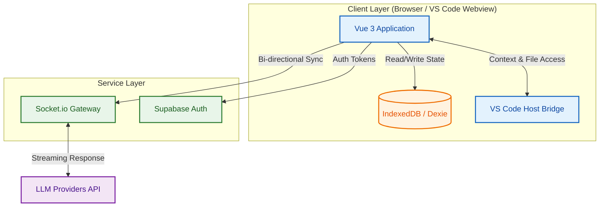
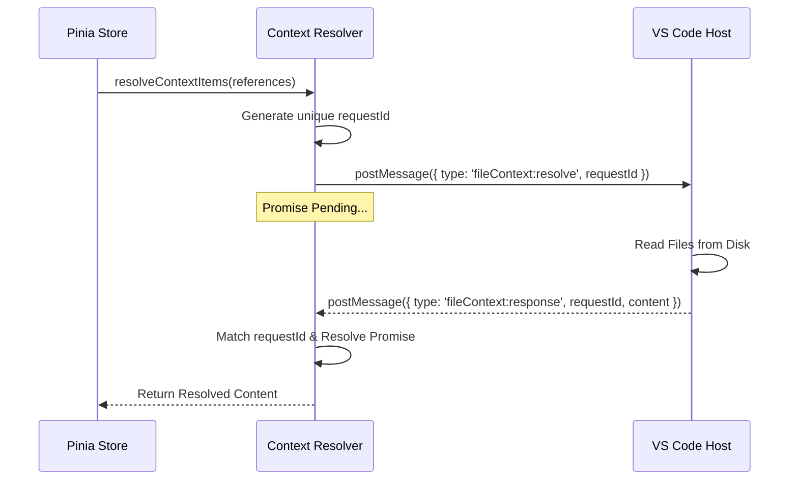
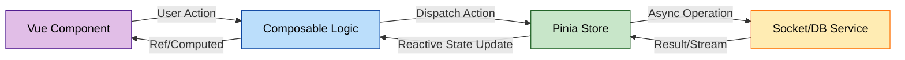
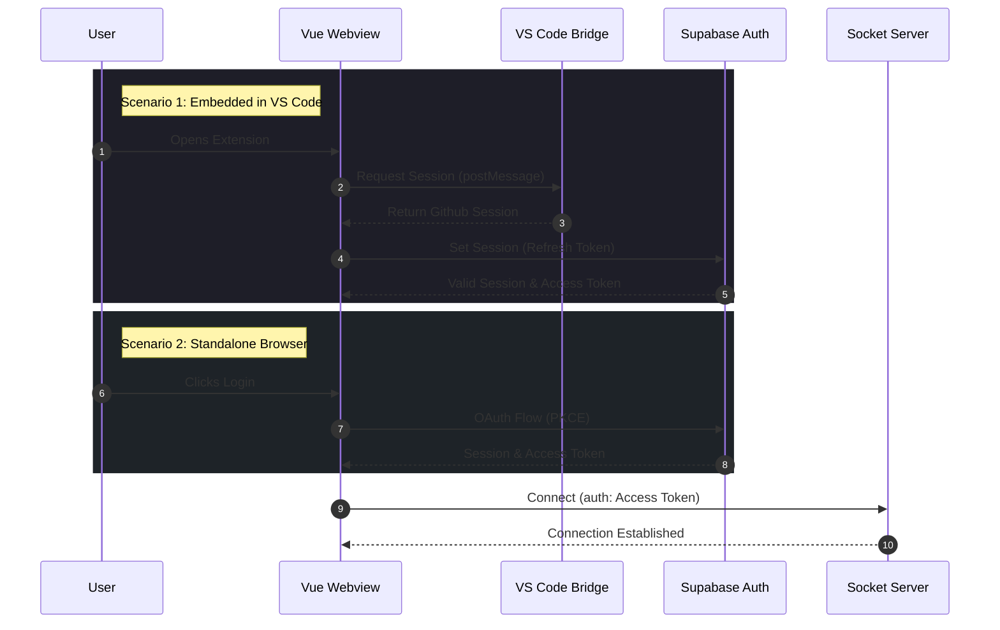
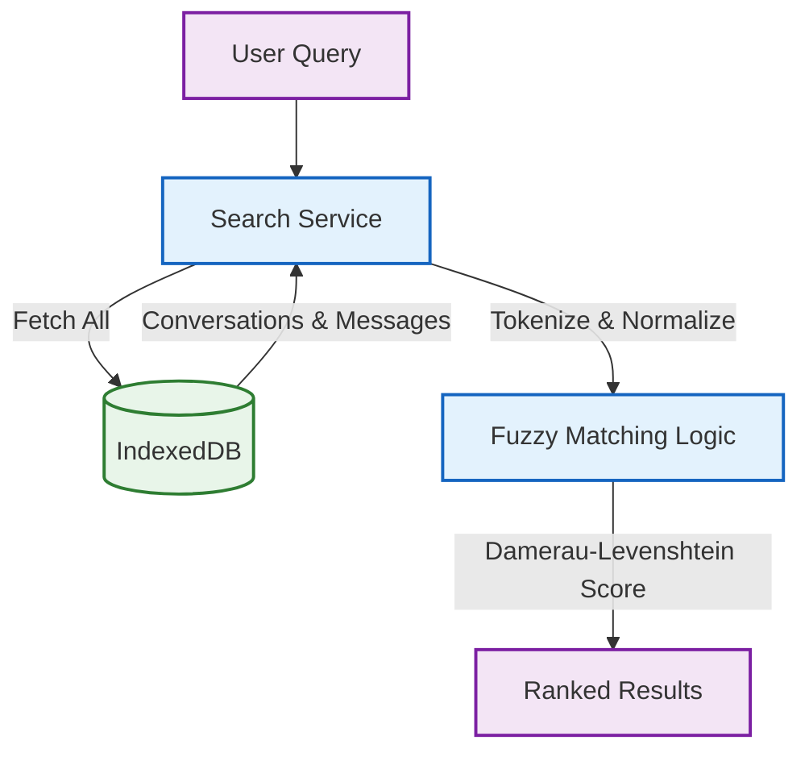

# babadeluxe-webview

<p align="left">
  
  
  
  
</p>

> **The chat UI for BabaDeluxe AI Coder.** A Vue 3 webview embedded in the VS Code extension, with full support for real-time streaming, Mermaid diagrams, KaTeX math, and persistent local chat history.

## Overview

This repo contains the frontend that runs inside the VS Code webview panel. It communicates bidirectionally with the extension host via a typed message bridge, connects to the backend over Socket.io, and stores all chat history locally in IndexedDB via Dexie.

## Architecture & Tech Stack

- **Core:** Vue 3 (Composition API) + TypeScript
- **State:** Pinia
- **Build:** Vite
- **Styling:** UnoCSS (Tailwind conventions)
- **Persistence:** Dexie.js (IndexedDB)
- **Real-time:** Socket.io-client
- **Validation:** Zod + neverthrow
- **Testing:** Vitest (unit) + Playwright (E2E)


```mermaid
graph TD
    classDef client fill:#e3f2fd,stroke:#1565c0,stroke-width:2px,color:#0d47a1
    classDef backend fill:#e8f5e9,stroke:#2e7d32,stroke-width:2px,color:#1b5e20
    classDef storage fill:#fff3e0,stroke:#ef6c00,stroke-width:2px,color:#e65100
    classDef ext fill:#f3e5f5,stroke:#7b1fa2,stroke-width:2px,color:#4a148c

    subgraph ClientLayer ["Client Layer (Browser / VS Code Webview)"]
        direction TB
        VueApp[Vue 3 Application]:::client
        DexieDB[(IndexedDB / Dexie)]:::storage
        VSCodeBridge[VS Code Host Bridge]:::client
    end

    subgraph ServiceLayer ["Service Layer"]
        SocketServer[Socket.io Gateway]:::backend
        Supabase[Supabase Auth]:::backend
    end

    External[LLM Providers API]:::ext

    VueApp -->|Read/Write State| DexieDB
    VueApp -->|Bi-directional Sync| SocketServer
    VueApp -->|Auth Tokens| Supabase
    VueApp <-->|Context & File Access| VSCodeBridge

    SocketServer <-->|Streaming Response| External
```

## Key Architecture Concepts

### VS Code Message Bridge

A typed message bridge handles all communication between the Vue app and the extension host. File contents are resolved asynchronously via request/response pairs keyed by a unique `requestId`:


```mermaid
sequenceDiagram
    participant Store as Pinia Store
    participant Resolver as Context Resolver
    participant Host as VS Code Host

    Store->>Resolver: resolveContextItems(references)
    Resolver->>Resolver: Generate unique requestId
    Resolver->>Host: postMessage({ type: 'fileContext:resolve', requestId })

    Note over Resolver: Promise Pending...

    Host->>Host: Read Files from Disk
    Host-->>Resolver: postMessage({ type: 'fileContext:response', requestId, content })

    Resolver->>Resolver: Match requestId & Resolve Promise
    Resolver-->>Store: Return Resolved Content
```

### State & Data Layer

Pinia stores are the single source of truth for all domain state. The Dexie layer adds custom `SafeCollection`/`SafeTable` wrappers for type-safe IndexedDB access and a `KeyValueDb` store with automatic `updatedAt` tracking.


```mermaid
flowchart LR
    classDef view fill:#e1bee7,stroke:#4a148c,color:#000
    classDef logic fill:#bbdefb,stroke:#0d47a1,color:#000
    classDef state fill:#c8e6c9,stroke:#1b5e20,color:#000
    classDef infra fill:#ffecb3,stroke:#ff6f00,color:#000

    View[Vue Component]:::view
    Composable[Composable Logic]:::logic
    Store[Pinia Store]:::state
    Service[Socket/DB Service]:::infra

    View -->|User Action| Composable
    Composable -->|Dispatch Action| Store
    Store -->|Async Operation| Service
    Service -->|Result/Stream| Store
    Store -->|Reactive State Update| Composable
    Composable -->|Ref/Computed| View
```

### Error Handling

`neverthrow` replaces thrown exceptions with typed `Result` objects throughout the codebase. Custom error classes (`DbError`, `NetworkError`, `RateLimitError`) give each layer its own failure vocabulary. Critical network calls use `retryWithBackoff` with exponential backoff and jitter.

### Authentication

Two strategies depending on where the webview runs:

- **Embedded in VS Code** — auth tokens are bridged from the extension host via `useVsCodeAuth`, no re-login needed
- **Standalone browser** — standard Supabase PKCE OAuth flow (GitHub / Email)


```mermaid
sequenceDiagram
    autonumber
    participant User
    participant Webview as Vue Webview
    participant Bridge as VS Code Bridge
    participant Supabase as Supabase Auth
    participant Socket as Socket Server

    rect rgb(30, 30, 40)
        note right of User: Scenario 1: Embedded in VS Code
        User->>Webview: Opens Extension
        Webview->>Bridge: Request Session (postMessage)
        Bridge-->>Webview: Return Github Session
        Webview->>Supabase: Set Session (Refresh Token)
        Supabase-->>Webview: Valid Session & Access Token
    end

    rect rgb(30, 35, 40)
        note right of User: Scenario 2: Standalone Browser
        User->>Webview: Clicks Login
        Webview->>Supabase: OAuth Flow (PKCE)
        Supabase-->>Webview: Session & Access Token
    end

    Webview->>Socket: Connect (auth: Access Token)
    Socket-->>Webview: Connection Established
```

### Streaming & Rendering

Socket.io token events are committed to the store on a throttled interval (`streamingCommitIntervalMs`) to avoid blocking the main thread during fast generation. The `ChatMarkdownRenderer` handles partial streams including Mermaid diagrams, KaTeX, and syntax-highlighted code via DOMPurify sanitization.

### Search

Client-side conversation search uses Damerau-Levenshtein distance for fuzzy matching, running entirely in the browser against the local IndexedDB.


```mermaid
graph TD
    classDef input fill:#f3e5f5,stroke:#7b1fa2,stroke-width:2px
    classDef process fill:#e3f2fd,stroke:#1565c0,stroke-width:2px
    classDef store fill:#e8f5e9,stroke:#2e7d32,stroke-width:2px

    UserInput[User Query]:::input --> SearchService
    SearchService[Search Service]:::process -->|Fetch All| DB[(IndexedDB)]:::store
    DB -->|Conversations & Messages| SearchService
    SearchService -->|Tokenize & Normalize| FuzzyLogic[Fuzzy Matching Logic]:::process
    FuzzyLogic -->|Damerau-Levenshtein Score| Results[Ranked Results]:::input
```

## Project Structure

| Directory | Purpose |
| :--- | :--- |
| `src/composables/` | Reusable Composition API logic |
| `src/stores/` | Pinia stores for conversations, context, and UI state |
| `src/database/` | Dexie.js layer with `SafeTable` and `KeyValueDb` wrappers |
| `src/vs-code/` | Message bridge, type guards, and VS Code protocols |
| `src/components/` | `Base*` design system components and feature widgets |
| `src/views/` | Route-level pages: Chat, History, Prompts, Settings |
| `src/validators/` | Zod schemas for runtime validation |

## Prerequisites

- **Node.js**: v20.19.0+ or v22.12.0+
- **Package Manager**: PNPM v9+

## Getting Started

```bash
pnpm install
pnpm dev
```

For performance profiling:

```bash
pnpm dev-performance
```

### Environment

Copy the example env file and fill in your values:

```bash
cp .env.local.example .env.local
```

See [docs/ARCHITECTURE.md](docs/ARCHITECTURE.md) for a full breakdown of env files, Vite modes, and deployment stages.

## Scripts

| Script | Description |
| :--- | :--- |
| `dev` | Start Vite dev server |
| `build` | Type-check and produce production build |
| `test` | Run unit + E2E test suites |
| `test-unit` | Vitest unit tests only |
| `test-e2e` | Playwright E2E tests only |
| `type-check` | TypeScript type checking |
| `format` | XO + Prettier lint and format |
| `find-dead-code` | Knip analysis for unused exports |

## License

This project is licensed under the **European Union Public License 1.2 (EUPL-1.2)**.

---

**BabaDeluxe** — _Redefining the Future of Software Development._
