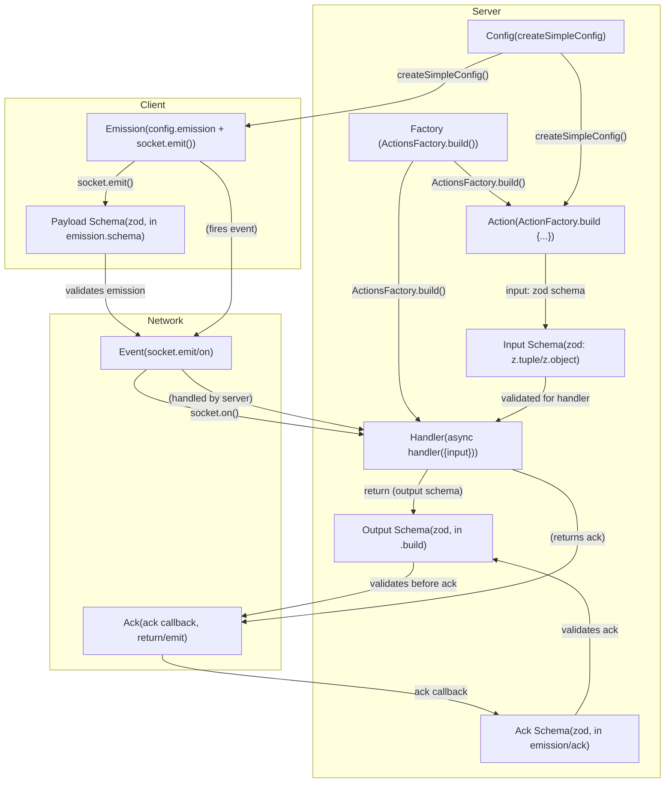

```mermaid
flowchart TD
  subgraph Server
    Factory["Factory (ActionsFactory.build())"]
    Config["Config(createSimpleConfig)"]
    Action["Action(ActionFactory.build {...})"]
    InputSchema["Input Schema(zod: z.tuple/z.object)"]
    Handler["Handler(async handler({input}))"]
    OutputSchema["Output Schema(zod, in .build)"]
    AckSchema["Ack Schema(zod, in emission/ack)"]
  end

  subgraph Network
    Event["Event(socket.emit/on)"]
    Ack["Ack(ack callback, return/emit)"]
  end

  subgraph Client
    Emission["Emission(config.emission + socket.emit())"]
    PayloadSchema["Payload Schema(zod, in emission.schema)"]
  end

  Factory -- "ActionsFactory.build()" --> Action
  Factory -- "ActionsFactory.build()" --> Handler

  Config -- "createSimpleConfig()" --> Emission
  Config -- "createSimpleConfig()" --> Action

  Action -- "input: zod schema" --> InputSchema
  InputSchema -- "validated for handler" --> Handler
  Handler -- "return (output schema)" --> OutputSchema
  OutputSchema -- "validates before ack" --> Ack

  Emission -- "socket.emit()" --> PayloadSchema
  PayloadSchema -- "validates emission" --> Event

  Event -- "socket.on()" --> Handler
  Ack -- "ack callback" --> AckSchema
  AckSchema -- "validates ack" --> OutputSchema

  Emission -- "(fires event)" --> Event
  Event -- "(handled by server)" --> Handler
  Handler -- "(returns ack)" --> Ack
```
