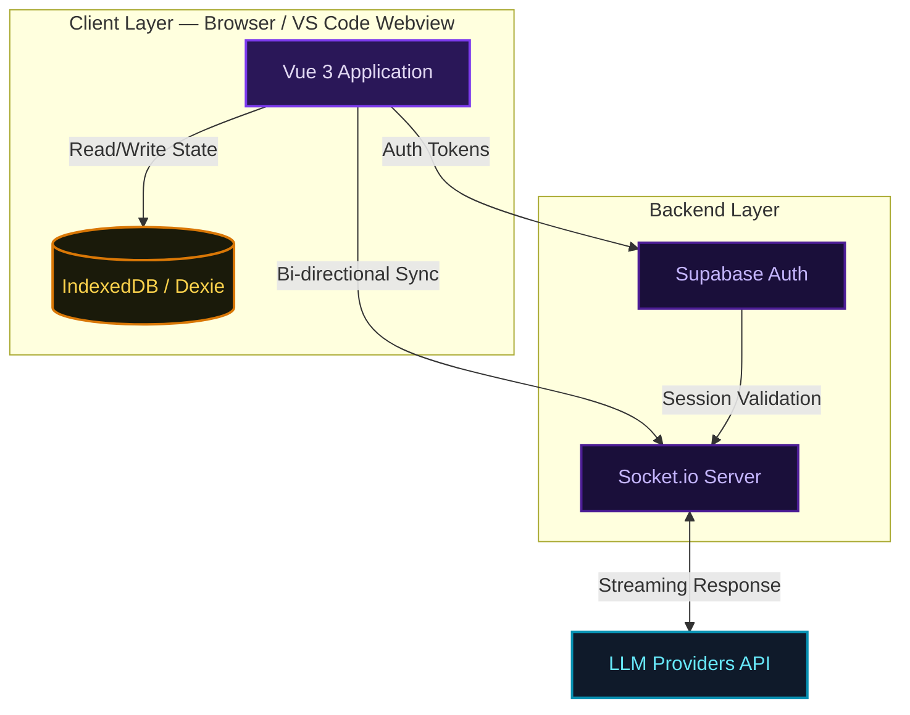
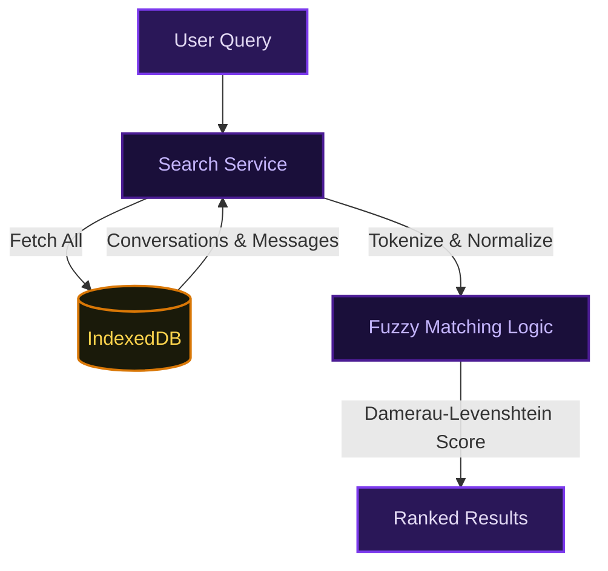

# Architecture

## Overview

This repo is the Vue 3 frontend that runs inside the VS Code webview panel. It communicates bidirectionally with the extension host via a typed message bridge, connects to the backend over Socket.io, and stores all chat history locally in IndexedDB via Dexie.



## Tech Stack

| Layer       | Library                              | Notes                                       |
| :---------- | :----------------------------------- | :------------------------------------------ |
| Core        | Vue 3 (Composition API) + TypeScript | Strict mode, no Options API                 |
| State       | Pinia                                | One store per domain                        |
| Build       | Vite                                 | HMR in dev, optimized ESM output            |
| Styling     | UnoCSS                               | Tailwind conventions, atomic                |
| Persistence | Dexie.js                             | IndexedDB wrapper with custom safe wrappers |
| Real-time   | Socket.io-client                     | See [HTTP.md](./HTTP.md)                    |
| Validation  | Zod + neverthrow                     | Runtime schemas + typed Results             |
| Testing     | Vitest (unit) + Playwright (E2E)     | See `TESTING_GUIDELINE.md`                  |

## Dependency Injection

We enforce strict DI using Vue's `provide`/`inject` mechanism with `Symbol`-based keys and a `safeInject` helper. This guarantees runtime availability and makes dependencies trivially mockable in tests.

```ts
// injection-keys.ts
export const APP_DB_KEY: InjectionKey<AppDb> = Symbol('AppDb')
export const LOGGER_KEY: InjectionKey<AbstractLogger> = Symbol('Logger')
```

```ts
// App.vue — provide at root
provide(APP_DB_KEY, appDb)
provide(LOGGER_KEY, logger)
```

```ts
// Any composable or store — consume safely
const appDb = safeInject(APP_DB_KEY)
// Throws a descriptive error at runtime if the key was never provided,
// instead of silently handing back undefined.
```

`safeInject` wraps `inject()` and throws immediately with a clear message if the symbol is missing — no silent `undefined` leaking into business logic.

## State & Data Layer

Pinia stores are the single source of truth for all domain state. The Dexie layer adds custom wrappers for type-safe IndexedDB access.

```mermaid
flowchart LR
    classDef view fill:#2a1758,stroke:#7c3aed,stroke-width:2px,color:#e2d9f3
    classDef logic fill:#1a0f3a,stroke:#4c1d95,stroke-width:2px,color:#c4b5fd
    classDef state fill:#0f2a1a,stroke:#059669,stroke-width:2px,color:#6ee7b7
    classDef infra fill:#1a1a0a,stroke:#d97706,stroke-width:2px,color:#fcd34d

    View[Vue Component]:::view
    Composable[Composable Logic]:::logic
    Store[Pinia Store]:::state
    Service[Socket / DB Service]:::infra

    View -->|User Action| Composable
    Composable -->|Dispatch Action| Store
    Store -->|Async Operation| Service
    Service -->|Result / Stream| Store
    Store -->|Reactive State Update| Composable
    Composable -->|Ref / Computed| View
```



### SafeCollection / SafeTable

Raw Dexie collections are wrapped in `SafeCollection` and `SafeTable` to enforce strong typing and prevent schema drift at runtime. Every DB operation returns a `Result<T, DbError>` — no naked throws.

### KeyValueDb

A specialized store on top of Dexie for key-value pairs (e.g. API keys, user preferences). Automatically tracks `updatedAt` on every write. Access is always via typed keys — no string indexing.

## Modular Composables

Logic is encapsulated in composables rather than bloated components:

| Composable                  | Responsibility                                              |
| :-------------------------- | :---------------------------------------------------------- |
| `use-chat-socket`           | Send messages, resume interrupted streams                   |
| `use-file-context-resolver` | Resolve file references via VS Code message bridge          |
| `use-tracked-timeouts`      | Register timeouts that are automatically cleared on unmount |
| `use-socket-listener`       | Type-safe Socket.io event subscriptions                     |
| `use-date-formatter`        | Locale-aware date/time formatting                           |

## Streaming & Rendering

Socket.io token events are committed to the store on a throttled interval (`streamingCommitIntervalMs`) to avoid blocking the main thread during fast generation. Chunks are appended directly to the reactive `messages` ref — no intermediate buffer.

The `ChatMarkdownRenderer` handles partial streams including:

- Mermaid diagrams (rendered after stream completes)
- KaTeX math
- Syntax-highlighted code blocks
- DOMPurify sanitization on all HTML output

## Client-Side Search

Conversation search runs entirely in the browser against the local IndexedDB using Damerau-Levenshtein distance for fuzzy matching. No server round-trip. Queries are tokenized and normalized before scoring.



## Project Structure

| Directory          | Purpose                                                          |
| :----------------- | :--------------------------------------------------------------- |
| `src/composables/` | Reusable Composition API logic                                   |
| `src/stores/`      | Pinia stores for conversations, context, and UI state            |
| `src/database/`    | Dexie.js layer with `SafeTable` and `KeyValueDb` wrappers        |
| `src/vs-code/`     | Message bridge, type guards, and VS Code protocols               |
| `src/components/`  | `Base*` design system components and feature widgets             |
| `src/views/`       | Route-level pages: Chat, History, Prompts, Settings              |
| `src/validators/`  | Zod schemas for runtime validation                               |
| `src/services/`    | Domain services: `ChatContextManager`, `ApiKeyValidator`, search |
