# Authentication

The webview supports two authentication strategies depending on where it runs.

## Strategies

| Strategy | When | Composable |
| :--- | :--- | :--- |
| VS Code token bridge | Embedded in the extension | `useVsCodeAuth` |
| Supabase PKCE OAuth | Standalone browser / dev | Supabase JS client |

## VS Code Bridge Auth

When embedded, the extension host already holds a valid GitHub session from the VS Code authentication provider. The webview requests it via `postMessage` on mount — no re-login required.

`useVsCodeAuth` listens for the session response, sets it on the Supabase client via `supabase.auth.setSession()`, then passes the access token to the Socket.io connection.

## Supabase PKCE OAuth

For standalone browser usage (local dev, staging), a standard PKCE flow is used:

1. User clicks Login → `supabase.auth.signInWithOAuth({ provider: 'github', flowType: 'pkce' })`
2. GitHub redirects back to the webview with an auth code
3. Supabase exchanges the code for a session and access token
4. Access token is passed to the Socket.io connection

## Full Auth Flow

```mermaid
%%{init: {'theme': 'base', 'themeVariables': {'background': '#13111a', 'primaryColor': '#2a1758', 'primaryTextColor': '#e2d9f3', 'primaryBorderColor': '#7c3aed', 'lineColor': '#7c3aed', 'secondaryColor': '#1a0f3a', 'actorBkg': '#2a1758', 'actorBorder': '#7c3aed', 'actorTextColor': '#e2d9f3', 'signalColor': '#c4b5fd', 'signalTextColor': '#e2d9f3', 'noteBkgColor': '#1a0f3a', 'noteTextColor': '#c4b5fd', 'fontFamily': 'monospace'}}}%%
sequenceDiagram
    autonumber
    participant User
    participant Webview as Vue Webview
    participant Bridge as VS Code Extension Host
    participant Supabase as Supabase Auth
    participant Socket as Socket Server

    rect rgb(26, 15, 58)
        note right of User: Scenario 1 — Embedded in VS Code
        User->>Webview: Opens Extension
        Webview->>Bridge: Request Session (postMessage)
        Bridge-->>Webview: Return GitHub Session
        Webview->>Supabase: Set Session (Refresh Token)
        Supabase-->>Webview: Valid Session & Access Token
    end

    rect rgb(15, 26, 42)
        note right of User: Scenario 2 — Standalone Browser
        User->>Webview: Clicks Login
        Webview->>Supabase: OAuth Flow (PKCE)
        Supabase-->>Webview: Session & Access Token
    end

    Webview->>Socket: Connect with Access Token
    Socket-->>Webview: Connection Established
```

## API Key Validation

API keys are never stored without validation. Before persisting to `KeyValueStore`, `ApiKeyValidator` performs a live check against the provider's API endpoint. If it fails, the key is rejected and the store is never written — the system stays in a valid state.

## Session Synchronization

Supabase emits `SIGNED_IN` / `SIGNED_OUT` / `TOKEN_REFRESHED` events. The app subscribes via `supabase.auth.onAuthStateChange()` and propagates token changes to the active Socket.io connection via `SocketManager.updateAuthToken()` — no reconnect required.
